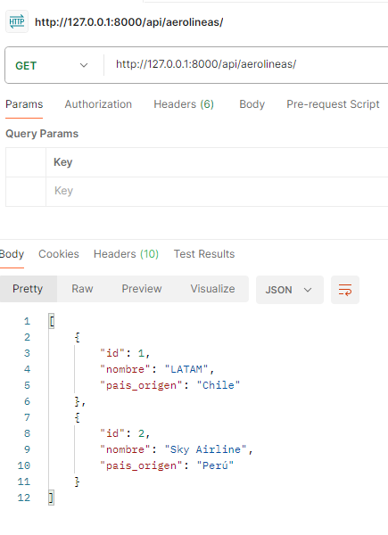
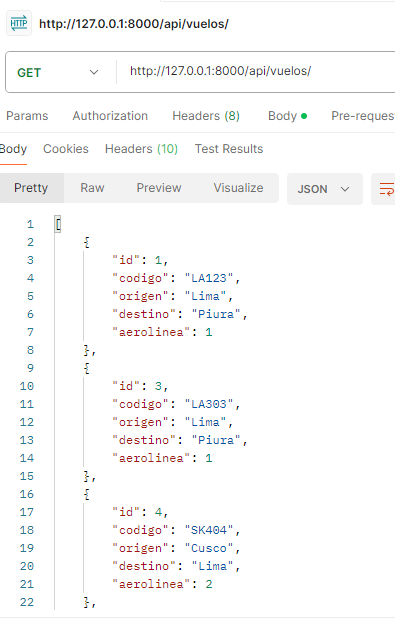
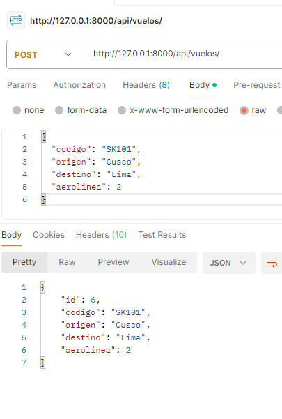
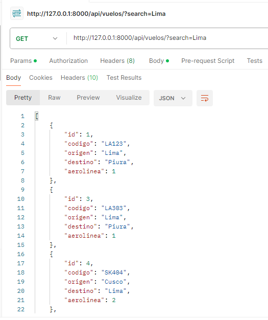

# ✈️ SkyRoute API

API REST desarrollada con Django y Django REST Framework para gestionar vuelos y aerolíneas.

Permite realizar CRUD completo, búsqueda y relación entre entidades.

---

## 🚀 Tecnologías
- Python
- Django
- Django REST Framework
- SQLite

---

## ⚙️ Ejecución

git clone https://github.com/pabloislaarone/skyroute_api.git  
cd skyroute_api  
python -m venv venv  
venv\Scripts\activate  
pip install django djangorestframework  
python manage.py migrate  
python manage.py runserver  

---

## 📌 Endpoints

### Aerolíneas
- GET /api/aerolineas/
- POST /api/aerolineas/

Ejemplo:
{
  "nombre": "LATAM",
  "pais_origen": "Chile"
}

---

### Vuelos
- GET /api/vuelos/
- POST /api/vuelos/

Ejemplo:
{
  "codigo": "LA123",
  "origen": "Lima",
  "destino": "Cusco",
  "aerolinea": 1
}

---

## 🔍 Búsqueda

GET /api/vuelos/?search=Lima

---

## ⭐ Extra

Se incluye el campo `aerolinea_nombre` en la respuesta.

---

## 🧪 Pruebas

### Aerolíneas

### Vuelos

### Crear vuelo

### Búsqueda

---

## 🐙 Repo
https://github.com/pabloislaarone/skyroute_api